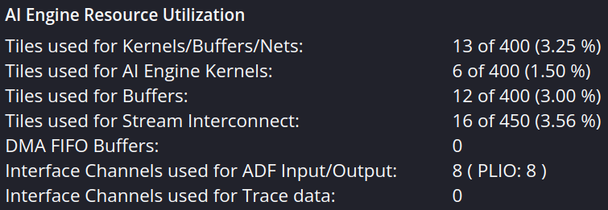
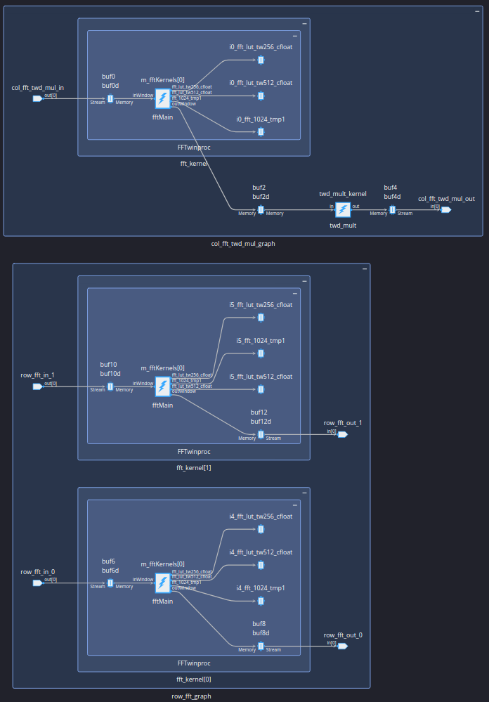
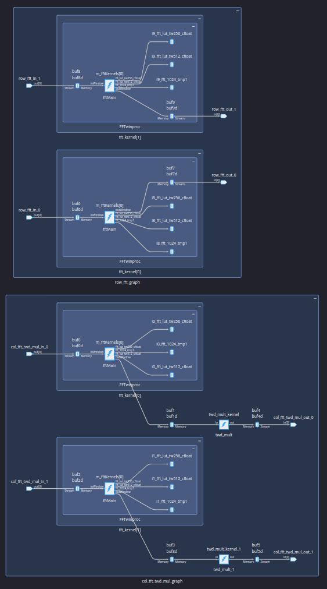
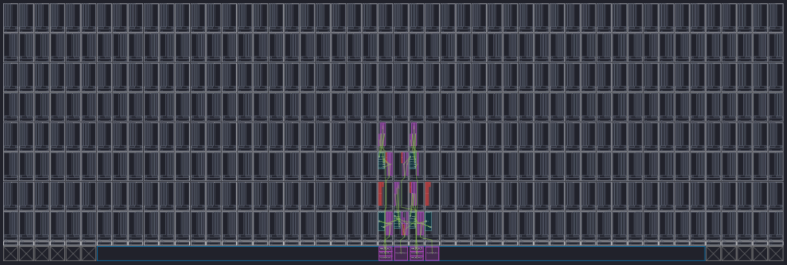
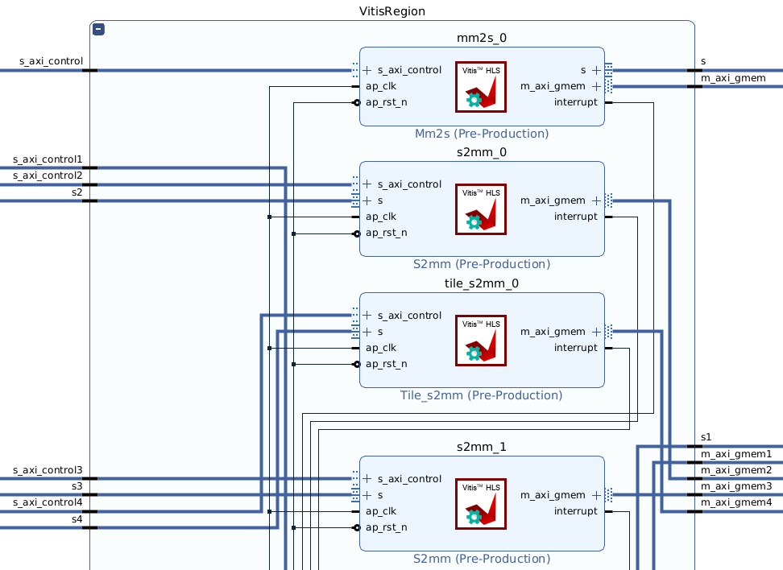
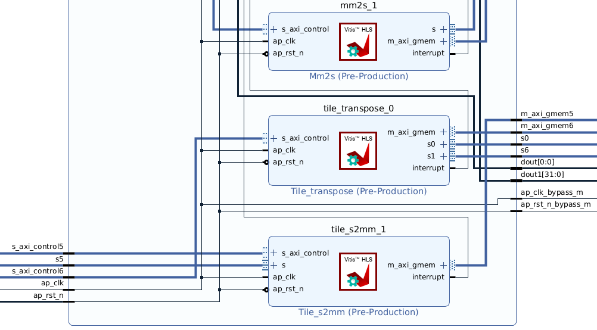
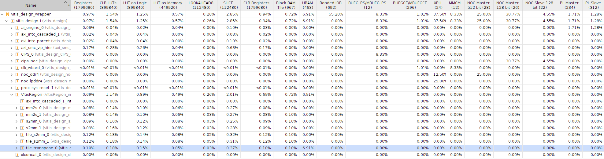
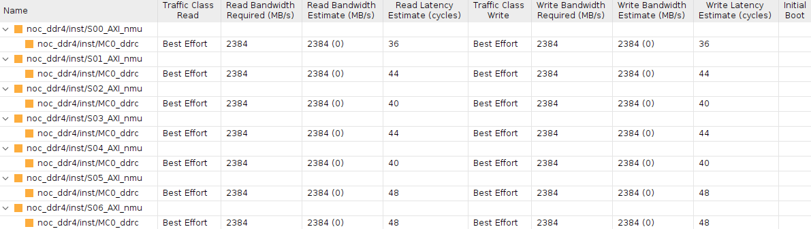

## How to compile
```
make aie        // if update aie design
make hls        // if update hls design
make xsa        // if update aie or hls
make host       // if update xsa or host design
make package    // if update host
```
## How to verify
```bash
# Host side
cd verify
bash copy_sd_card.sh

# FPGA side
./host.exe a.xclbin data_rx_1024_complex_64.npy

# Host side
cd verify
bash download_data.sh
python3 verify_output.py
```

## Implementation Result
| no parallelism | col.-wise proc. with 2-batch and row-wise proc. with 2-parallelism and 2-batch | both col.-wise and row-wise proc. with 2-parallelism and scheduling by PL |
| :---: | :---: | :---: |
| col. time req.: 79658 us <br> row time req.: 80362 us <br> total time req.: 160070 us | col. time req.: 59458 us <br> row time req.: 23440 us <br> total time req.: 82948 us | col. time req.: 2975 us <br> row time req.: 3711 us <br> total time req.: 6816 us |
||||
||||
||||

### Scheduling by PL
* time requirement
    * col.-wise proc.: (3041+2946+2953+2968+2917+2952+2945+3039+3001+2988)/10 = 2975.0 us
    * row-wise proc.: (3774+3786+3782+3783+3777+3786+3781+3883+3774+2988)/10 = 3711.4 us
    * total: (6863+6781+6782+6799+6761+6787+6775+6971+6823+6822)/10 = 6816.4 us
* block design

|||
|:---:|:---:|

* utilization


* NOC QoS


## Tile Wise Transpose IP
Refer to [Tile Wise Transpose IP](./document/tile_wise_transpose_ip.md)

# Comparing with GPU
* Raw data: 1024x22016 pixels
* GPU
    * (range FFT + element-wise mult. + range IFFT) of 1024 rows: 0.75 sec
* AIE
    * range FFT of 1 row: 0.16 sec