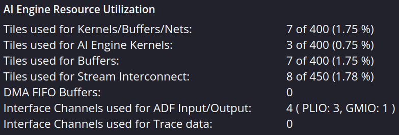
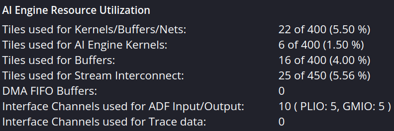
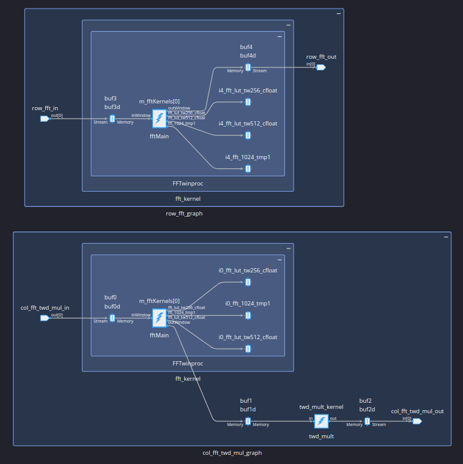
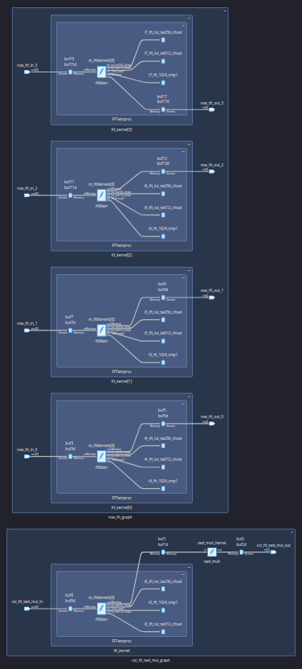
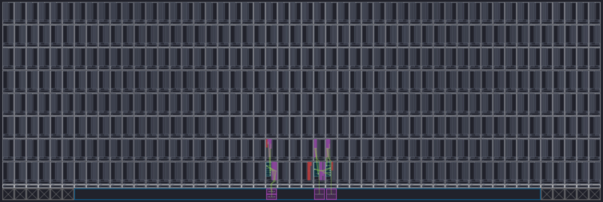
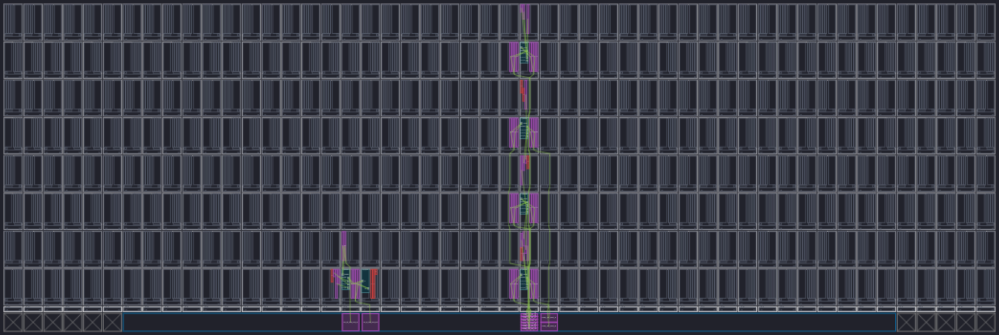
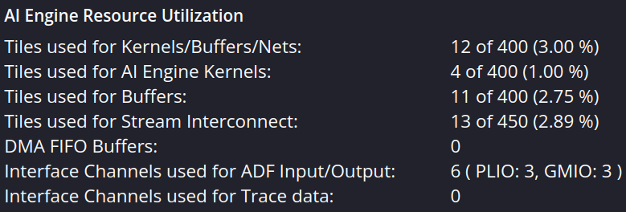
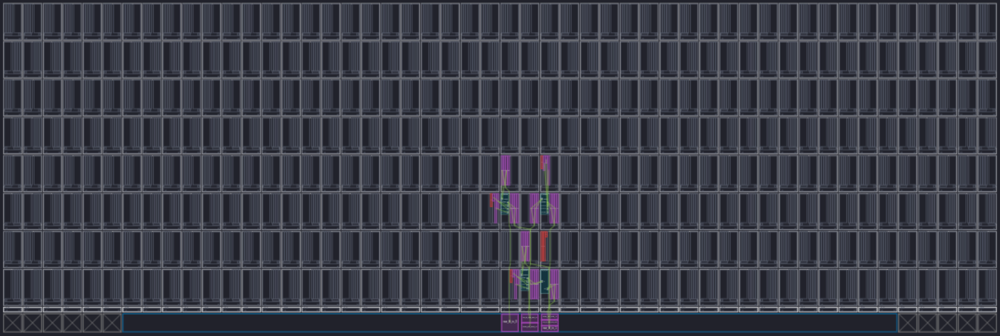
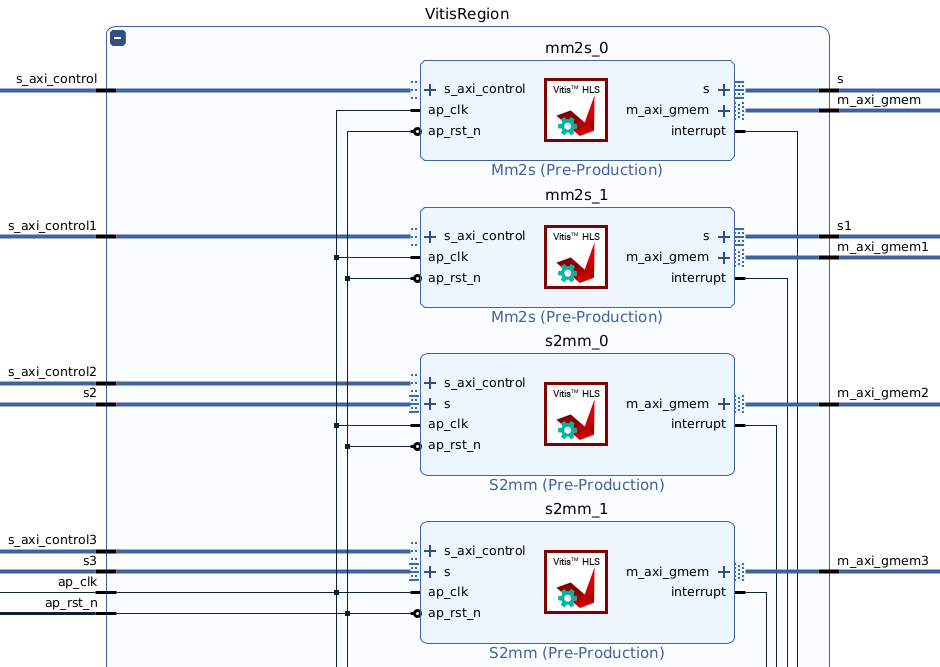
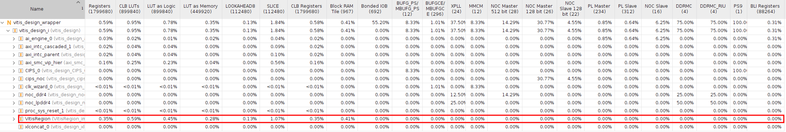

## How to compile
```
make aie        // if update aie design
make hls        // if update hls design
make xsa        // if update aie or hls
make host       // if update xsa or host design
make package    // if update host
```
## How to verify
```bash
# Host side
cd verify
bash copy_sd_card.sh

# FPGA side
./host.exe a.xclbin data_rx_1024_complex_64.npy

# Host side
cd verify
bash download_data.sh
python3 verify_output.py
```

## PS Flow Control
```c
// column-wise operation
for(int i=0; i<1024; i++){
    move_data_from_ddr_to_aie();
    trigger_fft_1024_twd_mult_graph();
    move_data_from_aie_to_ddr();
}
// row-wise operation
for(int i=0; i<1024; i++){
    move_data_from_ddr_to_aie();
    trigger_fft_1024_graph();
    move_data_from_aie_to_ddr();
}
```

## Implementation Result
<!-- | no parallelism | row-wise FFT with 4-parallelism and 2-batch |
| :---: | :---: |
| col. time req.: 79658 us <br> row time req.: 80362 us <br> total time req.: 160070 us | col. time req.: 72613 us <br> row time req.: 20494 us <br> total time req.: 93156 us |
|||
|||
||| -->
| no parallelism | col-wise proc. with 2-batch and row-wise proc. with 2-parallelism and 2-batch | both col-wise and row-wise proc. with 2-parallelism and 2-batch |
| :---: | :---: | :---: |
| col. time req.: 79658 us <br> row time req.: 80362 us <br> total time req.: 160070 us | col. time req.: 59458 us <br> row time req.: 23440 us <br> total time req.: 82948 us | col. time req.: 2968 us <br> row time req.: TODO <br> total time req.: TODO |
||||
||||
||||
||||
||||

# Comparing with GPU
* Raw data: 1024x22016 pixels
* GPU
    * (range FFT + element-wise mult. + range IFFT) of 1024 rows: 0.75 sec
* AIE
    * range FFT of 1 row: 0.16 sec