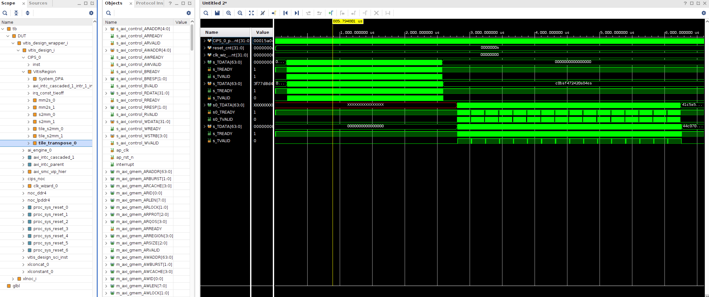

## How to Run Hardware Emulation
* Step 1: Compile
    * Revise `TARGET = hw_emu` of Makefile, which affects link and package
    * `launch_hw_emu.sh` will be generated after package
* Step 2: Run Emulation
    * Launch emulation: `./launch_hw_emu.sh`
    * Run application: `./host.exe a.xclbin data_rx_1_cpx_64_tr.npy`
    * Exit emulation: `ctrl+a+x`
    * Emulation result will be save at a folder, e.g. `sim/behav_waveform/xsim`
* Step 3: Open Result
    * Launch vivado
    * Open `*.wbd` on Tcl Console, e.g. `open_wave_database ../../media/jtc/Data/2024.2/Vitis/rda_dev_gmio/sim/behav_waveform/xsim/tb_behav.wdb`
    * Window -> Waveform 
    * Add to Waveform 
